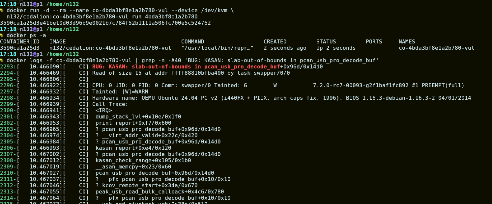

# Cedalion (bugs.sh)

We have discovered a more efficient approach to finding vulnerabilities in the
Linux kernel. Because the manpower to review LLM-generated patches is limited,
we make low-severity bugs public and ask for the community's help patching them,
similar to syzbot.

bugs.sh presents each disclosed issue with a reproduction environment and a PoC
that triggers the reported vulnerability. This repository contains the public
data and the [reproduction script](reproduction/repro.sh).

If you are interested in helping the Linux kernel address these security issues,
visit https://bugs.sh. You can also reach
us at co@bugs.sh.

## Reproduce a bug

```bash
# Build the image
reproduction/repro.sh build 4bda3bf8e1a2b780
# Run it
reproduction/repro.sh run 4bda3bf8e1a2b780
```

## Dataset (in-progress)

> Only public/patched (no race) bugs are currently included.

We are building an interactive reproduction dataset.

After an image has been pushed, another machine can reproduce the bug with one
Docker command:

```bash
docker run --rm --name co-4bda3bf8e1a2b780-vul --device /dev/kvm \
  n132/cedalion:co-4bda3bf8e1a2b780-vul run 4bda3bf8e1a2b780
```

Expected output:



## More

Detailed reproduction notes are in [`reproduction/README.md`](reproduction/README.md).
